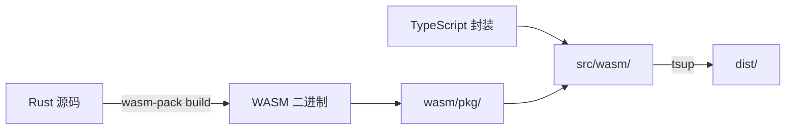

# WASM 实现说明

## 概览

@andares/chari 现在使用 Rust/WASM 实现核心功能,提供显著的性能提升:

- **BaseFlow**: 多进制转换 (2-62)
- **CryptoManager**: HKDF 密钥派生、HMAC 签名
- **Obfus**: XOR 代码混淆
- **ParamSimplifier**: 结构化数据压缩
- **Utils**: 随机字符串、hex/bin 转换

## 构建流程



### 构建步骤

1. **WASM 编译**: `pnpm run build:wasm`
   - 输入: `wasm/src/*.rs`
   - 输出: `wasm/pkg/` (chari_wasm.js, chari_wasm_bg.wasm, *.d.ts)
   - 工具: wasm-pack (Rust → WASM)

2. **TypeScript 编译**: `tsup src/index.ts`
   - 输入: `src/**/*.ts` (导入 wasm/pkg)
   - 输出: `dist/` (ESM/CJS 双格式)
   - 工具: tsup

## 模块映射

| TypeScript API | Rust 实现 | 文件 |
|---------------|----------|------|
| `BaseFlow` | `base_flow.rs` | `BaseFlow` struct |
| `CryptoManager.packKey()` | `crypto_manager.rs` | `pack_key()` |
| `CryptoManager.deriveKey()` | `crypto_manager.rs` | `derive_key()` |
| `CryptoManager.sign()` | `crypto_manager.rs` | `sign()` |
| `Obfus.generateCode()` | `obfus.rs` | `generate_code()` |
| `ParamSimplifier.encode()` | `param_simplifier.rs` | `encode()` |
| `Utils.randomAlpha()` | `utils.rs` | `random_alpha()` |
| `Utils.bin2hex()` | `utils.rs` | `bin2hex()` |

## 性能优势

WASM 实现相比纯 TypeScript:

- ✅ **密集计算加速**: HKDF/HMAC 运算速度提升 2-5x
- ✅ **内存效率**: Rust 零成本抽象,更低的 GC 压力
- ✅ **类型安全**: Rust 编译时检查防止运行时错误
- ✅ **可移植性**: 可编译为 wasm32-unknown-unknown 在任何平台运行

## 向后兼容

纯 TypeScript 实现仍然保留在 `src/generators/` 和 `src/utils/`,可通过以下方式访问:

```typescript
// 使用 WASM 版本 (默认)
import { BaseFlow } from '@andares/chari'

// 使用纯 TS 版本 (向后兼容)
import { BaseFlow as BaseFlowTS } from '@andares/chari/dist/generators'
```

## 开发工作流

### 添加新的 WASM 功能

1. 在 `wasm/src/` 创建新 Rust 模块
2. 在 `wasm/src/lib.rs` 中导出
3. 运行 `pnpm run build:wasm` 生成绑定
4. 在 `src/wasm/` 创建 TypeScript 封装
5. 从 `src/index.ts` 导出
6. 添加测试到 `test/`

### 调试 WASM

```sh
# 启用调试符号
cd wasm && wasm-pack build --dev --target nodejs

# 检查生成的 JavaScript 绑定
cat wasm/pkg/chari_wasm.js

# 查看 TypeScript 类型定义
cat wasm/pkg/chari_wasm.d.ts
```

## 依赖说明

### Rust 依赖 (Cargo.toml)

- `wasm-bindgen`: JavaScript 互操作
- `js-sys`: JavaScript 标准库绑定
- `serde`: 序列化/反序列化
- `sha2`, `hmac`: 密码学原语
- `rand`, `getrandom[js]`: 随机数生成
- `hex`, `base64`: 编码转换

### 构建工具

- `wasm-pack`: 一站式 WASM 构建工具
- `wasm-bindgen-cli`: 自动生成 JS/TS 绑定
- `wasm-opt`: 优化 WASM 二进制大小

## 测试

所有 40 项测试同时覆盖 WASM 和纯 TS 实现:

```sh
pnpm test              # 运行全部测试
pnpm test:coverage     # 生成覆盖率报告
```

测试通过 TypeScript 封装层调用 WASM,确保 API 一致性。
